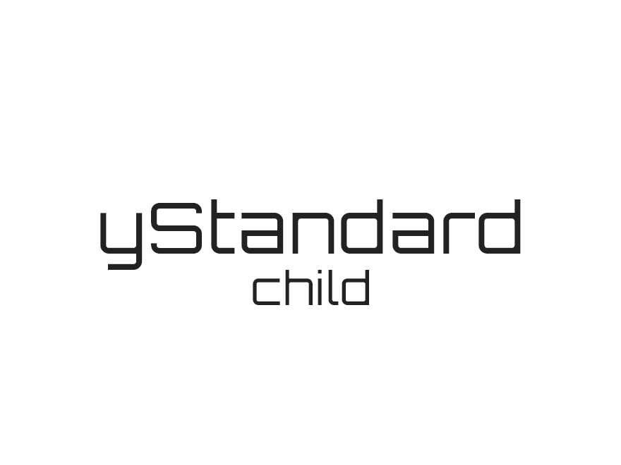

# ystandard-child

[ystanadard](https://github.com/yosiakatsuki/ystandard)の子テーマです。

詳細は[https://wp-ystandard.com/](https://wp-ystandard.com/)を御覧ください

## 変更履歴

- 2018/09/28
  - user-custom-editor-style.css 追加(yStandard v2.9.0対応)
- 2017/x/x
  - yStandard ver2.0.0 対応